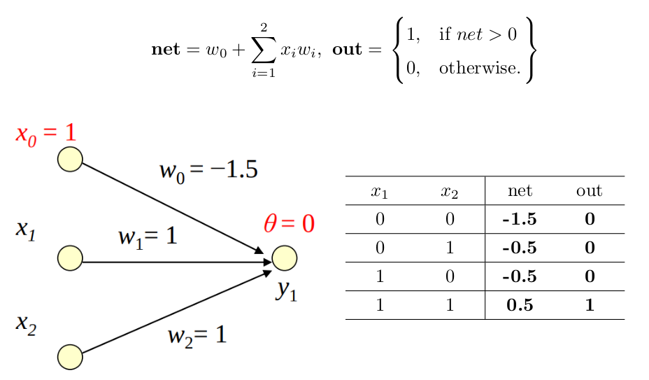
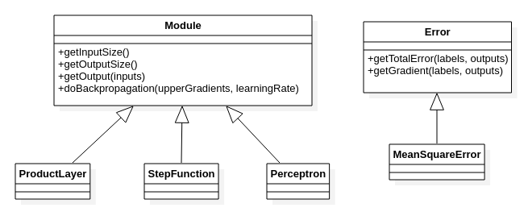
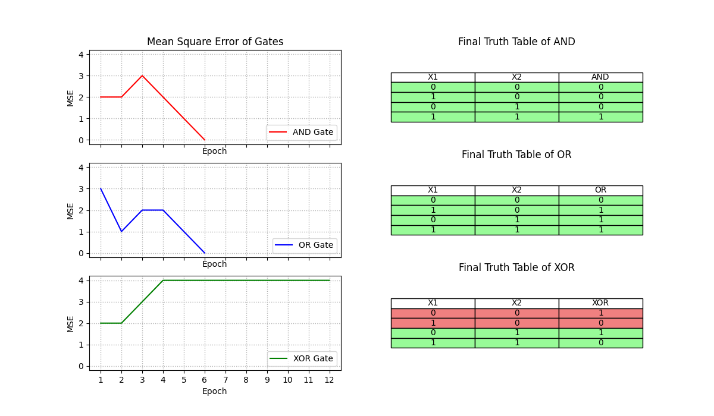
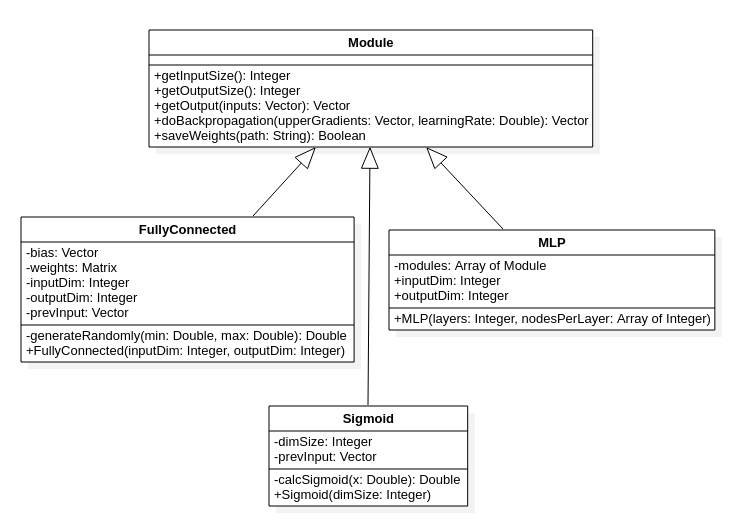
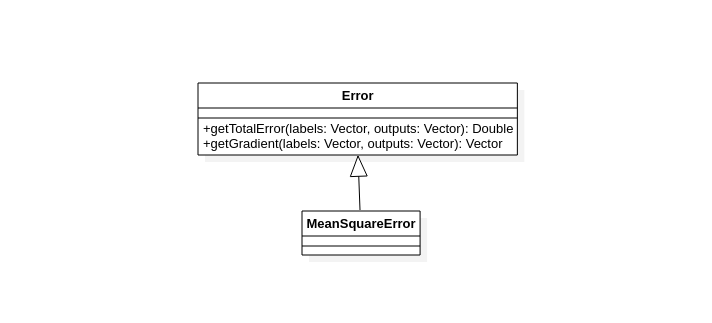
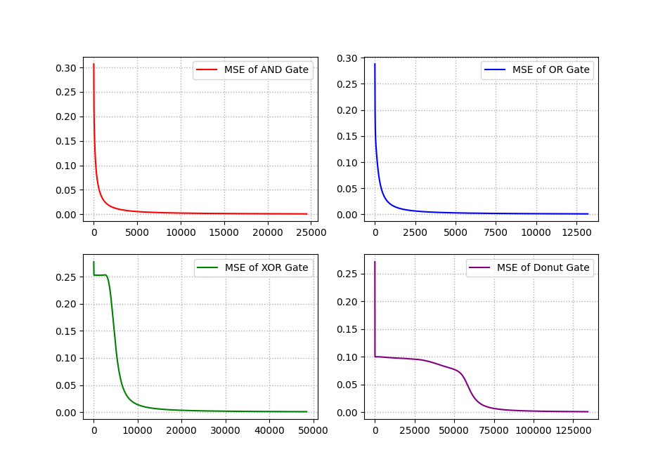
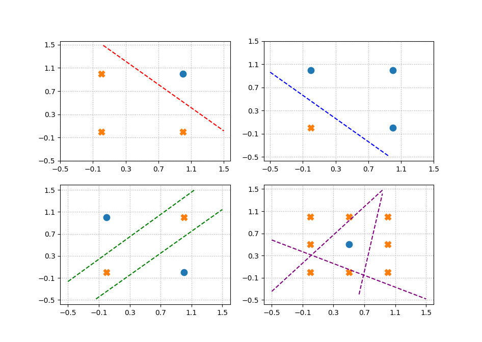
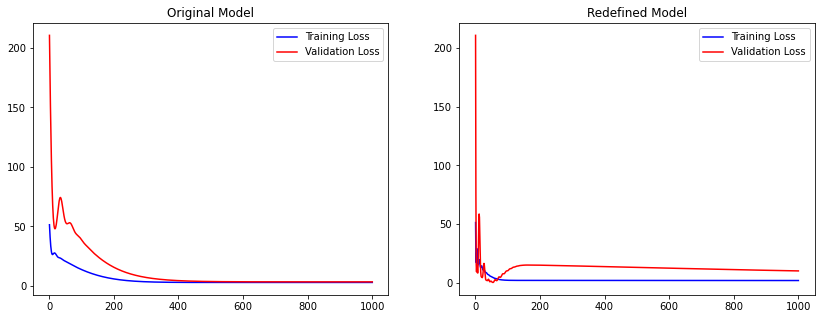
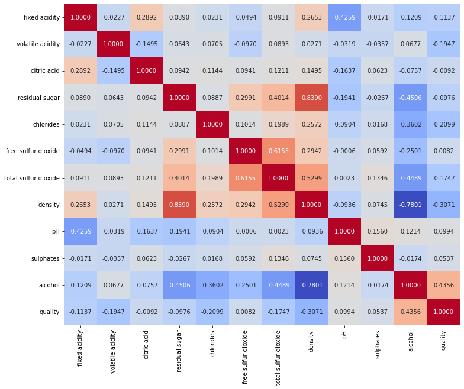
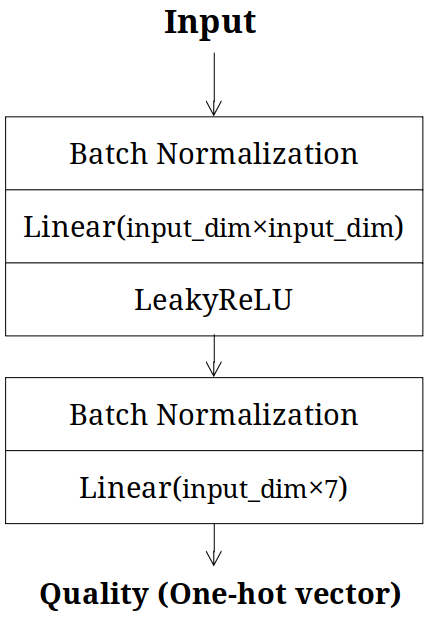

# 서울시립대학교 인공지능 (CS71020)

* 진행 학기: 2021-2
* 교과목: 인공지능(CS71020, 유하진 교수님)

2021 2학기에 진행한 인공지능 교과목의 과제 Repository입니다.

---

## 1. Perceptron

임의의 입력 차원을 가지는 1-Layer AND Perceptron을 C++로 구현하고 간선의 가중치를 사용자가 직접 업데이트할 수 있도록 한다.

Perceptron의 Activation으로 Hard Lift를 사용한다는 점에서 간선의 가중치를 어떻게 설정해야 올바른 AND Gate를 만들 수 있는지 쉽게 알 수 있다.

* [보고서 (PDF)](/1.%20Perceptron/report.pdf)
* [보고서 (TEX)](/1.%20Perceptron/report.tex)

### Figure 1-1: 올바른 AND Gate 가중치 설정

    </img>

---

## 2. 입력이 n차원인 Perceptron Learning 구현

2차원 입력을 받는 AND, OR, XOR Gate를 학습시킨다. 객체 지향적으로 구현하기 위해 각 Module이 공통된 추상 클래스를 상속받도록 하였고, 모델의 Backpropagation 역시 Module 클래스의 `doBackpropagation` 함수로 한번에 진행되도록 하였다.

* [보고서 (PDF)](/2.%20Learning/report.pdf)
* [보고서 (TEX)](/2.%20Learning/report.tex)

### Figure 2-1: 클래스 UML

    </img>

학습 결과는 아래와 같다. Multi Layer Perceptron이 아니기 때문에 AND, OR는 학습이 되지만 XOR은 학습할 수 없다.

### Figure 2-2: Loss 그래프와 최종 진리표

    </img>

---

## 3. Multi-Layer Perceptron 구현

이전 과제를 발전시켜 MLP(Multi-Layer Perceptron)을 학습시킨다. Layer의 수와 Layer 당 Node의 수를 변수(생성자의 Parameter)로 지정할 수 있어야 하며, 결과 Weight를 파일로 저장한다. AND, OR, XOR Gate 뿐만 아니라 도우넛 형태로 레이블링 되어있는 데이터도 학습할 수 있게끔 한다. (도우넛 형태의 의미는 [그림의](/3.%20Multi%20Layer/images/graph-lines.png) 오른쪽 아래 참고)

이전 과제에서 이미 각 Module을 클래스로 구현했기 때문에 이 과제를 위해서는 코드를 조금 발전시키는 것만으로도 충분하다. 마찬가지로 각 Module이 공통된 추상클래스를 상속 받도록 하였고 세부 Hyperparameter를 생성자로 설정할 수 있게 하였다.

* [보고서 (PDF)](/3.%20Multi%20Layer/report.pdf)
* [보고서 (TEX)](/3.%20Multi%20Layer/report.tex)

### Figure 3-1: 클래스 UML

    </img>

    </img>

### Figure 3-2: Loss 그래프

    </img>

### Figure 3-3: MLP가 학습한 직선들

    </img>

---

## 4. PyTorch Exercise

PyTorch의 기본적인 문법을 이용하여 아래 수식대로 Output을 계산하는 모델을 학습시킨다.

| 기존 모델 (수업에서 학습) | 새로 학습할 모델 (과제) |
|--|--|
|||

* [보고서 (PDF)](/4.%20PyTorch/report.pdf)
* [보고서 (TEX)](/4.%20PyTorch/report.tex)

### Figure 4-1: Loss 그래프 비교

    </img>

---

## 5. Wine Classifier

[Wine Quality 데이터](https://github.com/deep-learning-with-pytorch/dlwpt-code/blob/master/data/p1ch4/tabular-wine/winequality-white.csv)를 이용해서 와인의 품질(quality 열)를 학습하는 모델을 설계한다.

12개의 Column으로 구성된 Wine 데이터에서 Quality를 예측하는 모델을 간단한 분류 모델로 학습시켰다. 우선 데이터 자체에서 Quality와 상관관계가 큰 데이터가 무엇인지 알아내기 위해 Pearson 상관관계를 계산하였고, 상관관계의 절댓값에 따라 실험을 나누어 진행하였다. 모든 변수들(11개)을 모아 11차원 Input을 받는 모델을 실험해보고, 마찬가지로 상관관계의 절댓값이 0.1보다 큰 변수들(8개)만 이용하는 모델, 0.2보다 큰 변수들(3개)만 이용하는 모델을 실험해보았다.

그 결과 흥미롭게도 11개의 모든 변수들을 이용하는 모델이 가장 좋은 일반화
성능을 보였으며, 이는 상관관계가 낮은 변수라 할지라도 적절한 정규화 기법과 함께 이용하면 도움이 될 수 있다는 점을 시사한다.

* Model 1: **11개의 모든 데이터**를 Input으로 받아, 7차원의 One-hot vector를 출력하는 모델.
* Model 2: **상관 계수의 절댓값이 0.1 이상**인 8개의 데이터를 Input으로 받아, 7차원의 One-hot vector를 출력하는 모델.
* Model 3: **상관 계수의 절댓값이 0.2 이상**인 3개의 데이터를 Input으로 받아, 7차원의 One-hot vector를 출력하는 모델.

|         | Training Loss | Validation Loss | 정확히 맞힌 비율 | 1 이하의 차이로 맞힌 비율 |
|---------|---------------|-----------------|------------------|---------------------------|
| Model 1 |    **1.02239**    |     **1.06640**     |      **55.61%**      |           **95.92%**          |
| Model 2 |    1.05216    |     1.09959     |      52.55%      |           94.80%          |
| Model 3 |    1.16368    |     1.14929     |      50.41%      |           93.57%          |

* [보고서 (PDF)](/5.%20Wine/report.pdf)
* [보고서 (TEX)](/5.%20Wine/report.tex)

### Figure 5-1: 각 Column의 Pearson 상관관계

    </img>

### Figure 5-2: 모델 구조 (input_dim={11, 8, 3})

    </img>

### Figure 5-3: Loss 그래프 비교

| Model 1 | Model 2 | Model 3 |
|--|--|--|
||||